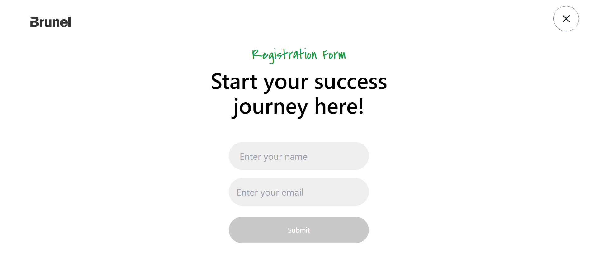

# Brune

## Technologies

- React
- Vite
- Tailwind CSS
- Node.js

## Getting Started

### Prerequisites

- Node.js (version 14 or newer)
- npm

### Installation

1.  Clone this repository: `git clone https://github.com/Adarshkumar03/brunel.git`
2.  Navigate to moodspace: `cd brunel`
3.  Install Dependencies: `npm install`

### Development Mode

1.  Start the Vite develpment server: `npm run dev`

### Production Build

1. Create an optimized build: `npm run build`
2. The `dist` folder produced by the build process contains static files. Deploy these to your preferred web hosting platform.

## Screenshots

### Home Page

### Registeration Page

### Registeration Form Error Page

### Success Page

